# Airbnb Clone | Spring Boot & Angular

A **full stack application** built with **Spring Boot (backend)** and **Angular (frontend)**, inspired by the Airbnb platform for managing accommodations, bookings, and users.

The project implements a modern, secure, and scalable architecture, with interactive documentation, automated deployment, and an attractive, responsive user experience using OAuth.

---

## 🚀 Key Highlights

- 🔐 **Advanced Security**: Secure authentication with **JWT** and role-based access control (**RBAC**).
- 🔐 **Modern Security**: Secure authentication using **OAuth** (with providers like Google/Auth0).
- 🏠 **Property Management**: Full CRUD for properties, bookings, and users.
- 📄 **API Documentation**: Interactive documentation with **Swagger/OpenAPI**.
- 🐳 **DevOps Deployment**: Containerization with **Docker** and orchestration with **Docker Compose**.
- ⚡ **Responsive UI**: Modern, adaptable interface optimized for mobile devices.
- 🗺️ **Interactive Maps**: Visualization of property locations (suggested integration with Leaflet or Google Maps).

---

## 🛠 Tech Stack

| Component   | Technologies                                                                 |
|-------------|------------------------------------------------------------------------------|
| **Backend** | Java 17, Spring Boot, Spring Security, JPA, Hibernate, MySQL/PostgreSQL      |
| **Frontend**| Angular 16, TypeScript, Bootstrap, SCSS, RxJS                                |
| **Security**| JWT, Bcrypt                                                                  |
| **DevOps**  | Docker, Docker Compose, Maven                                                |
| **Tools**   | Swagger/OpenAPI, Git, Angular CLI                                            |

---

## 📦 Features in Detail

### User & Role Management
- Registration, login, and password recovery.
- Distinct roles: landlord, tenant, and administrator.
- Editable user profile and credential management.

### Property & Booking Management
- CRUD for accommodations: create, edit, list, and delete.
- Booking management: create, view, cancel, and availability calendar.
- Host panel to manage owned properties and received bookings.

### Responsive UI/UX
- "Mobile First" design using **Flex** and **Flexbox** layout techniques, enhanced **SCSS**.
- Modern animations and UI components for an attractive and fluid user experience.

### Documentation & API
- Interactive REST API documentation available at `/swagger-ui/index.html`.
- Clear endpoint structure for integration with other systems or mobile apps.

### Security
- OAuth-based authentication and protection of sensitive routes.

### DevOps & Deployment
- Docker Compose orchestration for easy deployment in any environment.

---

## 📘 Documentation

### 🔹 Backend / Swagger UI

- The REST API documentation is available at:  
  `http://localhost:8080/swagger-ui/index.html`

  

---

## 🛠️ Main Flows

### 🔐 Security & Access
- **Secure login**: OAuth authentication (e.g., Google/Auth0), endpoint protection, and Angular guards.
- **Role management**: Differentiated access for landlords, tenants, and administrators.
- **Password recovery**: Secure email flow for password reset.

### 🏠 Property Management
- **Property publishing**: Advanced form for adding new properties.
- **Image gallery**: Upload and view photos for each property.
- **Interactive map**: Location visualization (suggested integration with Leaflet or Google Maps).

### 📅 Bookings
- **Availability calendar**: View and block dates.
- **Booking management**: Create, confirm, cancel, and automatic notifications.

---

## ⚙️ Technologies

### 🖥️ Backend (Spring Boot)
- **Java 17**: Leveraging the latest language features.
- **Spring Security**: Robust authentication and authorization.
- **Spring Data JPA**: Efficient persistence and advanced queries.
- **Liquibase**: Database versioning and migrations.
- **OAuth 2.0**: Token-based security.
- **Swagger/OpenAPI**: Interactive documentation.
- **Lombok**: Reduces boilerplate in entities and DTOs.
- **Maven**: Dependency management and build profiles.

### 🎨 Frontend (Angular)
- **Angular 16**: Modern, scalable framework.
- **TypeScript**: Strong typing and safe development.
- **RxJS**: Reactive programming for asynchronous data handling.
- **Bootstrap & SCSS**: Responsive and customizable UI.
- **Angular Router & Guards**: Protected navigation and access control.
- **Angular Forms**: Reactive forms and advanced validations.

### 🧪 DevOps
- **Docker & Docker Compose**: Agile, reproducible deployment.
- **Maven**: Build automation and profile management (dev/prod).

---

## 📐 Diagrams

### 🗄️ Database Schema (ER)


### 🏗️ System Architecture


---

## 🖥️ Interfaces

Below is a gallery of the main user interfaces of the Airbnb Clone application. Each screenshot demonstrates a key screen or flow in the system.

| Image | Filename | Description |
|-------|----------|-------------|
| 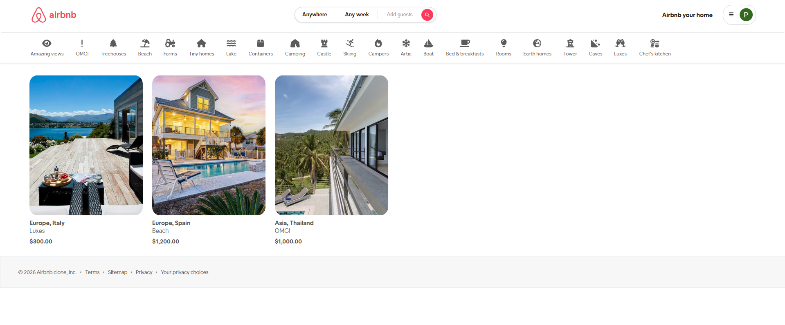 | home.png | Home page: main landing screen with featured properties and navigation. |
| 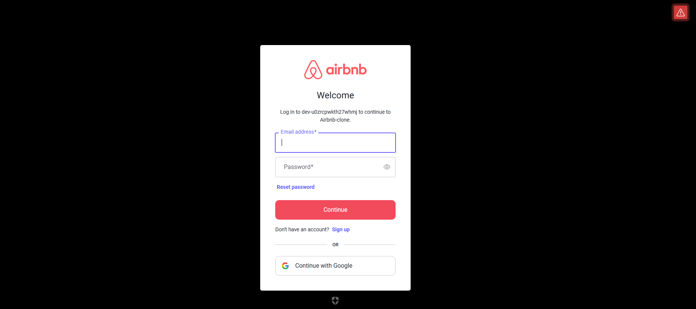 | login.png | Login screen: user authentication form. |
| 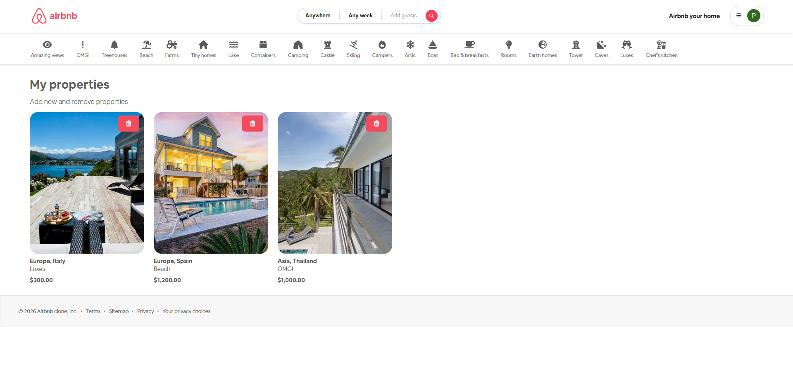 | my_properties.png | My Properties: list of properties owned by the user. |
| 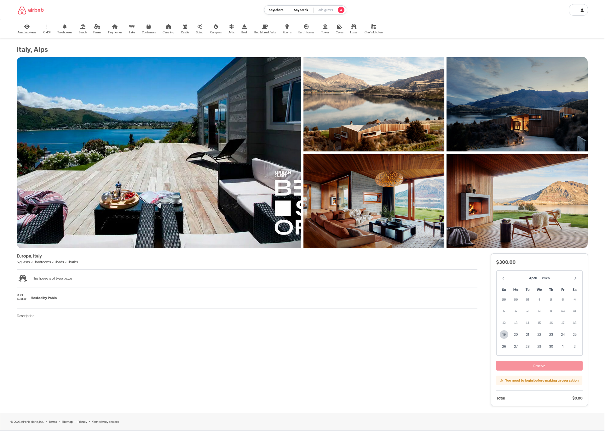 | my_properties_Detail.png | Property Detail: detailed view of a specific property. |
| 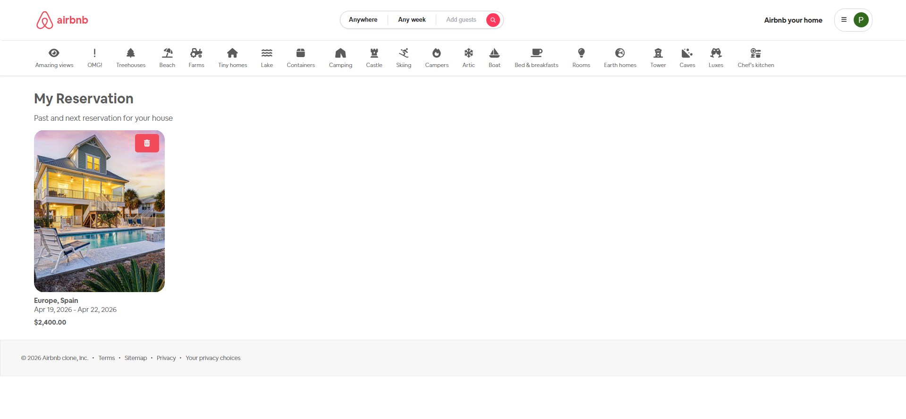 | my_reservation.png | My Reservations: overview of user bookings. |
| 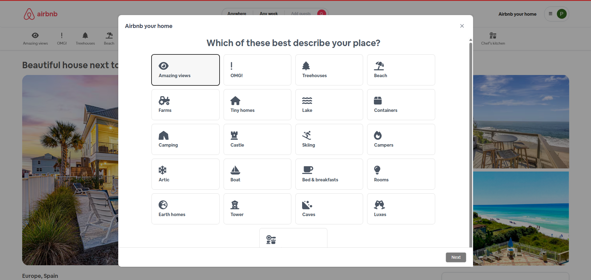 | new_property1.png | New Property (Step 1): start of the property creation wizard. |
| 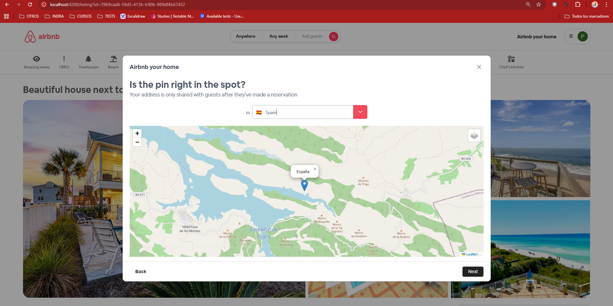 | new_property2.png | New Property (Step 2): property details input. |
| 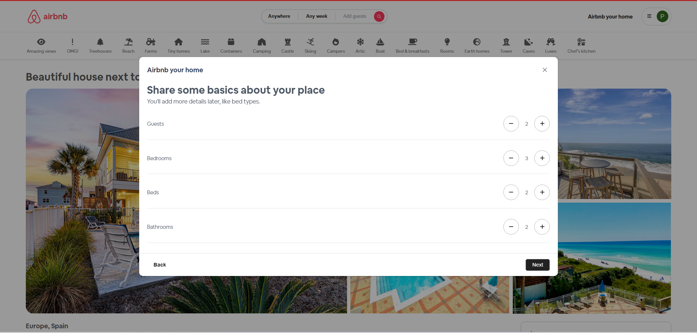 | new_property3.png | New Property (Step 3): location and map selection. |
| 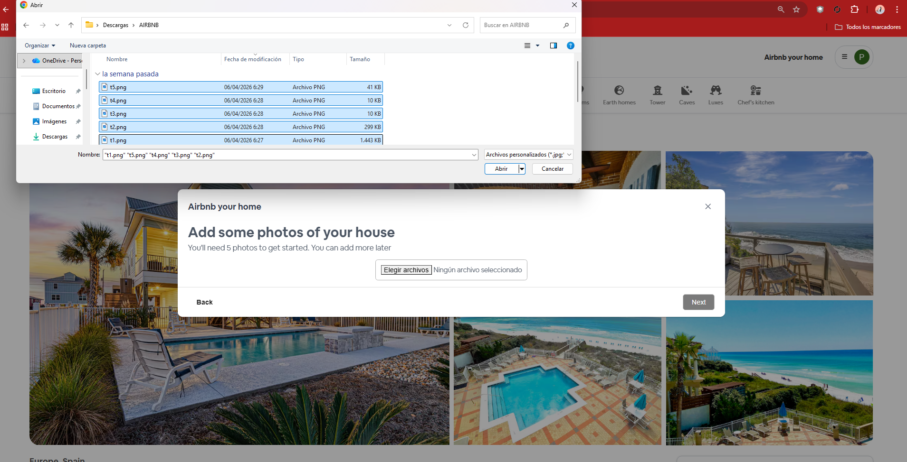 | new_property4.png | New Property (Step 4): amenities and features. |
| 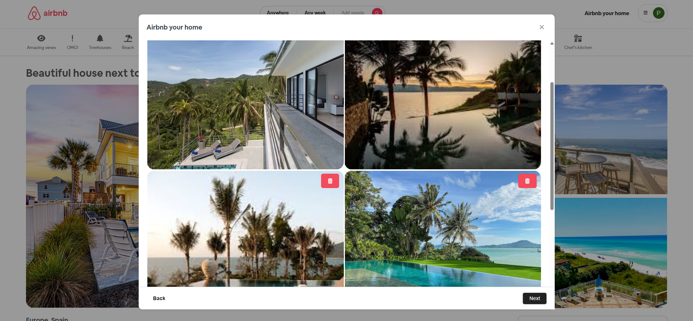 | new_property4b.png | New Property (Step 4b): image upload for property. |
| 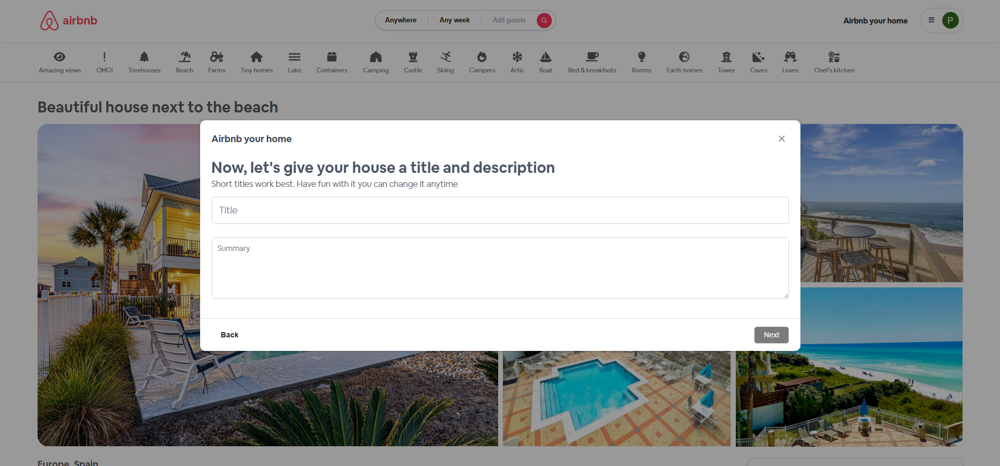 | new_property5.png | New Property (Step 5): summary and review. |
| 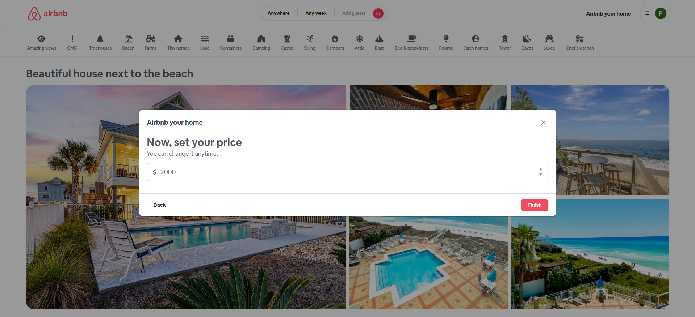 | new_property6.png | New Property (Step 6): confirmation and publish. |
| 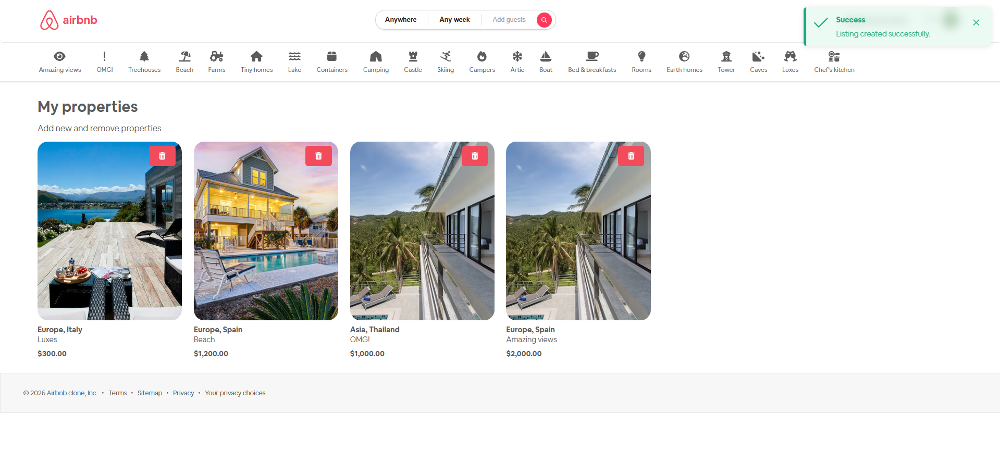 | new_property6b.png | New Property (Step 6b): final confirmation. |
| 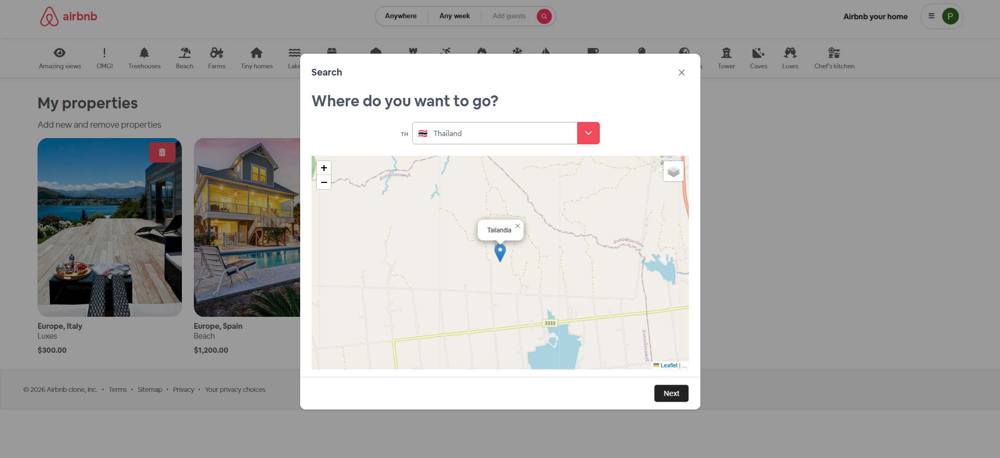 | search1.png | Search (Step 1): initial property search screen. |
| 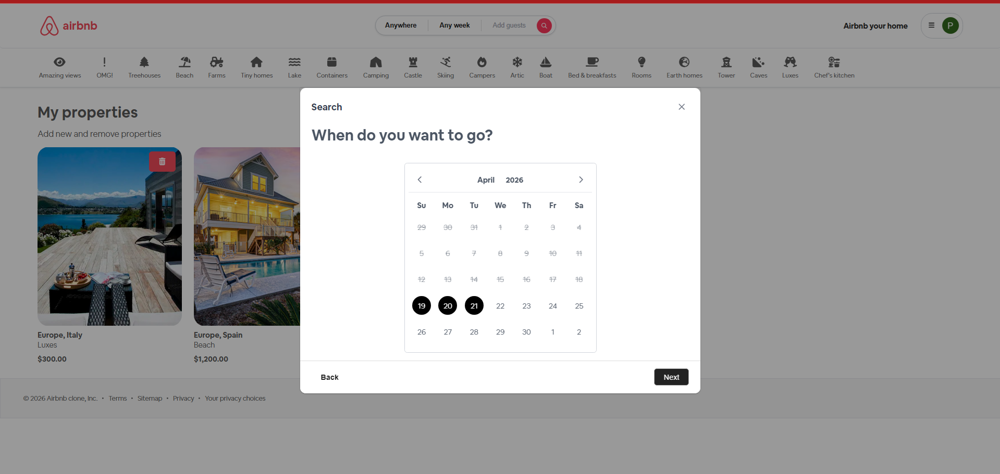 | search2.png | Search (Step 2): search with filters applied. |
| 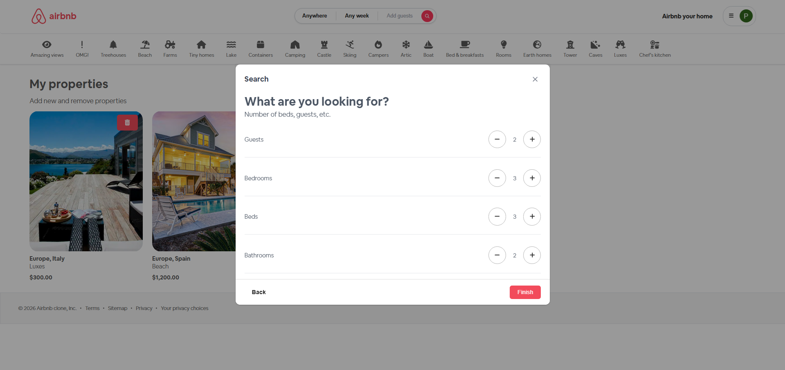 | search3.png | Search (Step 3): search results listing. |
| 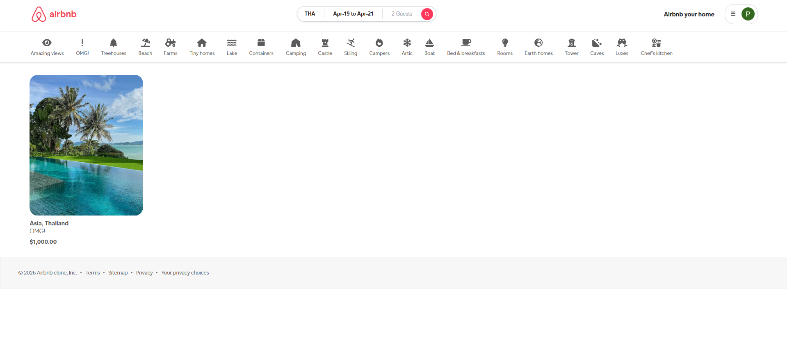 | search4.png | Search (Step 4): property detail from search results. |

## 📦 Installation & Deployment

1. **Clone the repository**
2. **Configure environment variables** in `application.yml` and `environment.ts` files.
3. **Build and start the containers**:
   ```bash
   docker-compose up --build
   ```
4. **Access the application**:
   - Frontend: `http://localhost:4200`
   - Backend/API: `http://localhost:8080`

---
